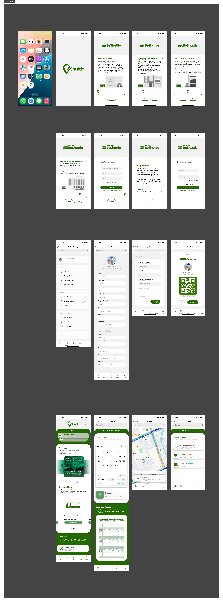
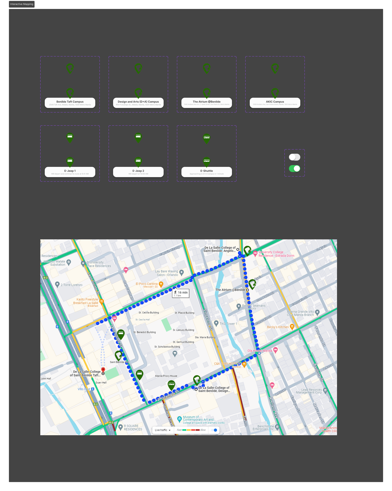
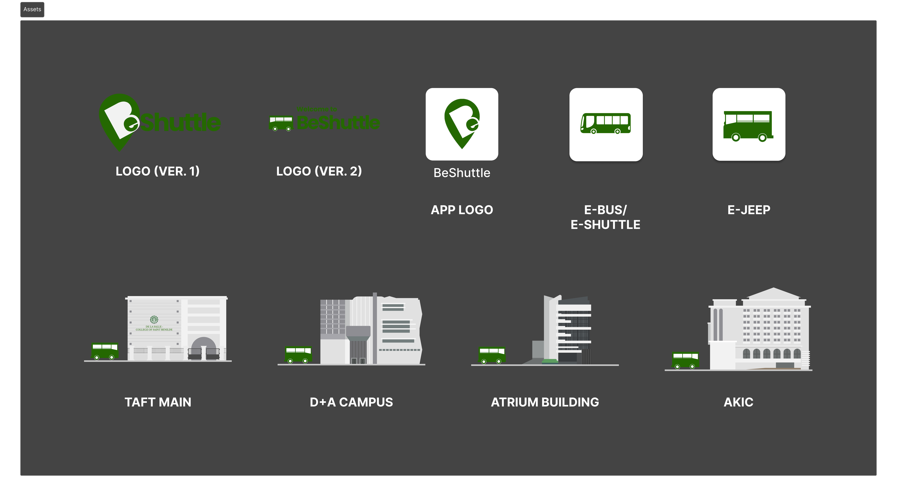

# BeShuttle: A Benilde E-Shuttle Tracker Companion Mobile Application | (UI/UX Design)
**Project Collaborator:** Joshua Vinson

## Figma Designs and Prototype  
🔗 **View the UI/UX Design:**   
🔗 **View the High-Fidelity Prototype:** 

## Project Overview  
BeShuttle is a mobile application designed for **De La Salle-College of Saint Benilde (DLS-CSB)** to enhance the efficiency of its e-shuttle service. The app provides **real-time tracking**, **schedule monitoring**, and **rider count updates** to address issues such as **unpredictable shuttle timings** and **lack of real-time updates**.

## Key Features  
- **GPS Real-Time Tracking** – Displays live shuttle locations.  
- **Schedule Monitoring** – Provides real-time arrival times and notifications for delays.  
- **Rider Count Updates** – Helps users manage shuttle availability and crowd levels.

## User Research Findings  
- 65% of users struggled with tracking shuttle whereabouts.  
- 35% expressed a need for rider count updates.  
- 60% reported issues due to the lack of real-time notifications.  
- **User Interviews:** Common frustrations included **inconsistent schedules** and **no live updates**.

## Competitive Analysis  
Compared to similar apps like **Pasahero, Irenbus, and RideExpress**, BeShuttle is tailored specifically for the **DLS-CSB community**, offering shuttle tracking and scheduling without privacy concerns.

## Wireframes & Prototype  
The app features an intuitive interface with key screens:  
- 🏠 **Home Screen** – Displays shuttle updates and schedules.  
- 📍 **Tracker Screen** – Shows real-time shuttle locations.  
- 📅 **Schedule Screen** – Allows users to check e-shuttle timetables.  
- 🔢 **Update Screen** – Provides live rider count data.

## Design Assets

### Low-Fidelity Key Screens  

### Prototype Key Screens  

### Interactive Mapping  

### General Assets  

## Usability Testing & Enhancements  
Based on user feedback, the following improvements were made:  
- Added **password tooltips** for better sign-up clarity.  
- Improved **profile customization** options.  
- Modified **timetable layout** for better readability.  
- Implemented **color-coded rider count system** for quick recognition.  
- Introduced a **tutorial for new users** upon app launch.

## Conclusion  
BeShuttle streamlines campus transportation by improving real-time visibility, scheduling, and rider experience. With continuous improvements based on user feedback, the app aims to make commuting within DLS-CSB more efficient and convenient.
